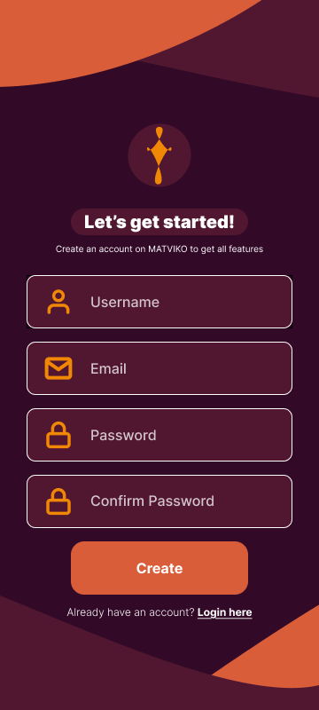
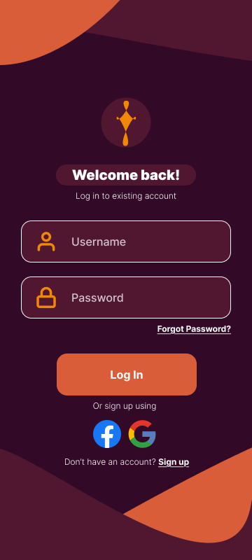
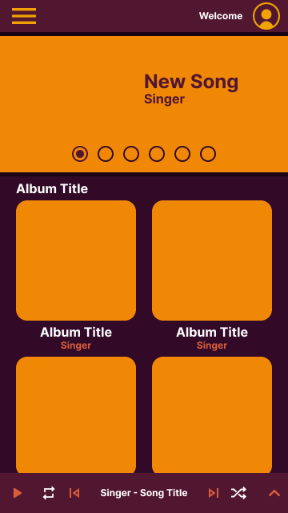

# MATVIKO - New Music App  

## Project Description  
**MATVIKO** is a mobile music streaming application similar to Spotify. The main goal of the project is to create a modern and user-friendly app that allows users to easily discover, listen to, and save music in one place.  

## Features  
- Stream music online through a clean and intuitive interface  
- Create and manage playlists  
- Search for songs, artists, and albums using keywords  
- Save favorite tracks for quick access  
- More features will be added during development  

## Tech Stack  

- **Language:** Kotlin  
- **UI:** Jetpack Compose  
- **Database:** MySQL  
- **Architecture:** No formal architecture (planned: Component-Based Architecture)  
- **Tools:** Android Studio, Gradle  

## Architecture  

The project follows a **Component-Based Architecture** approach.  

The application is built using independent and reusable components, primarily through Jetpack Compose. Each UI element (such as input fields, buttons, cards, and screens) is designed as a separate composable function with a single responsibility.  

This approach allows:  
- Better code reusability across different screens  
- Easier maintenance and scalability  
- Clear separation of UI elements into modular parts  
- Faster development by combining existing components  

Component-Based Architecture is well-suited for modern Android development with Jetpack Compose, as it aligns with declarative UI principles and promotes a clean, structured codebase.  

## Screens description

- **Registration Screen**  
  User registration

- **Login Screen**  
  User authentication  

- **Main Screen**  
  Main page with music

## Design Screenshots   

### Registration Screen


### Login Screen


### Main Screen


## Development Model  

The project uses the **Kanban** development model to keep the workflow organized and efficient.  

- Flexible task management without strict deadlines  
- Clear and visual workflow using a task board  
- Well-suited for small teams and easy task distribution  

## Project Structure

```
com.example.musicapp/
├── ui.theme/                # Colors, typography, theming
│   ├── Color.kt             # Colors
│   ├── Theme.kt             # Themes
│   └── Type.kt              # Typography
├── ApiService.kt            # Retrofit API interface (login, register, albums)
├── Common.kt                # Assets(Text fields, animations and so on)
├── LoginScreen.kt           # Login screen
├── MainActivity.kt          # Registration screen
├── MainScreen.kt            # Main screen
├── Models.kt                # Music API data models
├── manifests/               # App manifest
├── res/
│   ├── drawable/            # Images, icons
│   ├── mipmap/              # Launcher icons
│   ├── values/              # Strings, colors, dimens, styles
│   └── xml/                 # Backup and data extraction rules
└── test/                    # Unit and instrumented tests
```

## Team Members  

| Name | GitHub Username |
|------|----------------|
| Ivan Petrov | [@KRAKENN8](https://github.com/KRAKENN8) |
| Maksim Koroljov | [@rewazi](https://github.com/rewazi) |

## How to Run  

1. Clone the repository  
2. Open the project in Android Studio  
3. Sync Gradle dependencies
4. Import sql file in db 
5. Run the app on an emulator or physical device 
