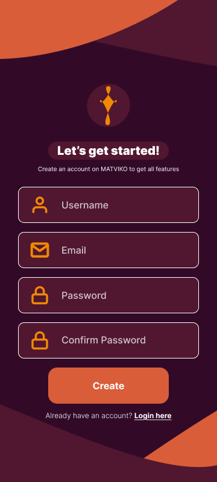
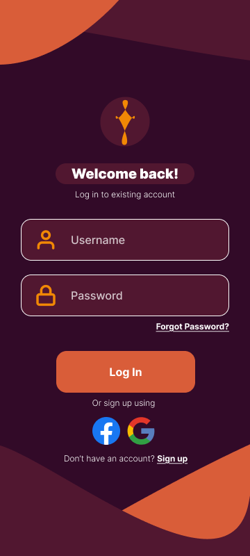
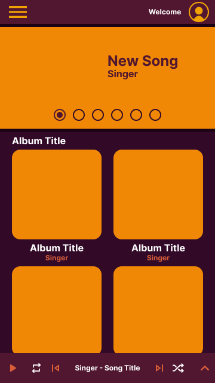

# MATVIKO - New Music App  

## 📑 Table of Contents

* [Project Description](#project-description)
* [Features](#features)
* [Tech Stack](#tech-stack)
* [Architecture](#architecture)
* [Figma Design](#figma-design)
* [Figma Prototype](#figma-prototype)
* [Screens Description](#screens-description)
* [Design Screenshots](#design-screenshots)
  * [Registration Screen](#registration-screen)
  * [Login Screen](#login-screen)
  * [Main Screen](#main-screen)
* [Development Model](#development-model)
* [Project Structure](#project-structure)
* [Backend Structure](#backend-structure)
* [Team Members](#team-members)
* [How to Run](#how-to-run)

## Project Description  
**MATVIKO** is a mobile music streaming application similar to Spotify. The main goal of the project is to create a modern and user-friendly app that allows users to easily discover, listen to, and save music in one place.  

## Features  
- Stream music online through a clean and intuitive interface  
- Create and manage playlists  
- Search for songs, artists, and albums using keywords  
- Save favorite tracks for quick access  
- More features will be added during development  

## Tech Stack  

- **Frontend Language:** Kotlin
- **Backend Language:** PHP  
- **UI:** Jetpack Compose  
- **Database:** MySQL
- **Architecture:** No formal architecture (planned: Component-Based Architecture)  
- **Tools:** Android Studio, Gradle, Figma, XAMPP  

## Architecture  

The project follows a **Component-Based Architecture** approach.  

The application is built using independent and reusable components, primarily through Jetpack Compose. Each UI element (such as input fields, buttons, cards, and screens) is designed as a separate composable function with a single responsibility.  

This approach allows:  
- Better code reusability across different screens  
- Easier maintenance and scalability  
- Clear separation of UI elements into modular parts  
- Faster development by combining existing components  

Component-Based Architecture is well-suited for modern Android development with Jetpack Compose, as it aligns with declarative UI principles and promotes a clean, structured codebase.  

[Open Architecture Diagram](https://www.figma.com/board/f9TFTRNdip6BZ9Y0K4THaf/MATVIKO-Diagram?node-id=0-1&t=XfEVVuiMuiSAzOnC-1)

## Figma Design
[Open Design](https://embed.figma.com/design/P5DO2QEGCQcNSQ66ul3D8d/MATVIKO?node-id=0-1&embed-host=share)

## Figma Prototype
[Open Prototype](https://www.figma.com/proto/P5DO2QEGCQcNSQ66ul3D8d/MATVIKO)

## Screens description

- **Registration Screen**  
  User registration

- **Login Screen**  
  User authentication  

- **Main Screen**  
  Main page with music

## Design Screenshots   

### Registration Screen


### Login Screen


### Main Screen


## Development Model  

The project uses the **Kanban** development model to keep the workflow organized and efficient.  

- Flexible task management without strict deadlines  
- Clear and visual workflow using a task board  
- Well-suited for small teams and easy task distribution  

## Project Structure

```
com.example.musicapp/
├── data/                         # Data layer
│   ├── local/                    # Local data
│   │   ├── Album.kt              # Local session and user data management
│   ├── model/                    # Data models
│   │   ├── Album.kt              # Album model
│   │   ├── Song.kt               # Song model
│   │   └── AuthResponse.kt       # Server response to authorization
│   └── network/                  # Retrofit
│       ├── ApiService.kt         # Description of API requests
│       └── RetrofitClient.kt     # Client сonfiguration
├── ui/                           # User interface
│   ├── components/               # Reusable components
│   │   ├── inputs/               # Input fields (InputField.kt)
│   │   ├── items/                # List elements (AlbumItem, DrawerItems, ProfileMenuItem)
│   │   ├── layout/               # Decorations and animations (WaveTop, WaveBottom, WaveState)
│   │   ├── player/               # Player elements (BottomPlayerBar, InfoChip)
│   │   └── social/               # Social icons (ExternalSocialIcon)
│   ├── navigation/               # Navigation
│   │   └── AppNavGraph.kt        # Route description
│   ├── screens/                  # Application screens (full pages)
│   │   ├── login/                # Logic and layout of the entrance
│   │   ├── registration/         # Registration
│   │   ├── main/                 # Home screen (MainContent, DrawerContent, SongInfoFullScreen and so on)
│   │   └── profile/              # User profile and change of data
│   └── theme/                    # Theming (Color.kt, Theme.kt, Type.kt)
├── MainActivity.kt               # Entry point, shared state management (Screen, WaveState)
├── manifests/                    # Application manifest
└── res/                          # Resources (drawable, mipmap, values)
```

## Backend Structure

```
musicapp/
├── db_config.php      # Database connection settings (MySQL)
├── get_albums.php     # Fetches albums + auto-finds covers via Deezer/Last.fm
├── get_songs.php      # Fetches songs + dynamic Deezer URL refresh
├── login.php          # User authentication function
└── register.php       # New user registration function
```

## Team Members  

| Name | GitHub Username |
|------|----------------|
| Ivan Petrov | [@KRAKENN8](https://github.com/KRAKENN8) |
| Maksim Koroljov | [@rewazi](https://github.com/rewazi) |

## How to Run  

1. Clone the repository  
2. Open the project in Android Studio  
3. Sync Gradle dependencies
4. Import sql file in db
5. Move in xampp\htdocs directory named "musicapp"
6. Start Apache and MySQL in XAMPP
7. Run the app on an emulator or physical device 
